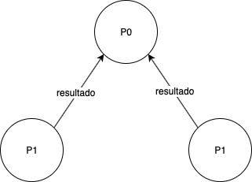
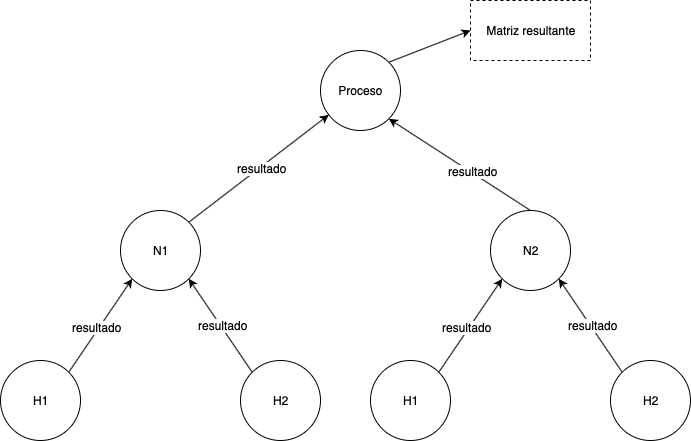

# Modelo PCAM

## Partición

A partir de la solución serial, podemos definir el algoritmo en tres partes:

- Llenado de la matriz
- Alineamiento de la matriz
- Puntuación

## Comunicación y aglomeración

Cada una de las tres partes se debe ejecutar de manera secuencial en el orden descrito en la partición. Es decir, primero el llenado, luego el alineamiento y luego la puntuación. Esto hace que la paralelización solamente se pueda hacer dentro de cada una de ellas en el momento de su "turno". 
Por lo tanto cada una se debe comunicar con la anterior para recibir su resultado y comenzar su ejecución. 

También se debe recibir el resultado de cada hilo de ejecución para hallar la matriz resultante en cada uno de los procesos definidos anteriormente, de esta manera:

## Mapeo

Cada hilo recibe partes iguales (o casi iguales si no eran pares) de la matriz, de esta manera cada hilo de procesamiento puede realizar su ejecución de manera independiente, de la misma manera cada nodo recibe partes iguales de la matriz para que este distribuya las cargas en cada hilo de procesamiento. Así se optimizan los recursos obtenidos para ejecutar el proceso y hay un balanceo de cargas adecuado. Como se describió anteriormente, cada hilo envía su resultado para generar la matriz resultante y enviar esta al proceso siguiente.

